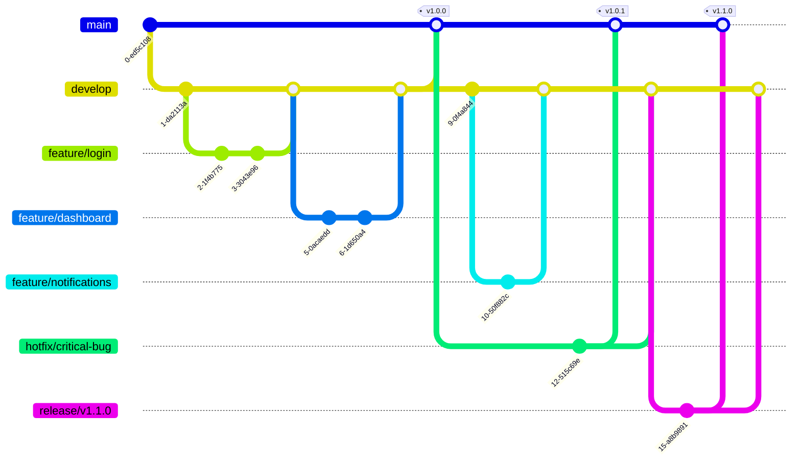

# Vue 3 + TypeScript Project

## Introduction

This template provides a complete setup for Vue 3 to work in Vite with TypeScript. It's designed to help you quickly start a new Vue project with modern technologies and an optimized project structure.

### System Requirements
- Node: >= 18.16.0
- NPM or Yarn

### Core Technology Versions
- Vue: v3.5.13
- Vite: v6.0.5
- TypeScript: ~5.6.2

## Installation and Running the Project

### Installing Dependencies

Use [npm](https://www.npmjs.com/) to install packages.

```bash
# Install dependencies
npm install

# Set up Husky for development environment
npm run prepare
```

### Running the Project in Development Mode

```bash
# Start development server
npm run dev
```

The application will run at the default address: http://localhost:5173

### Building the Project for Production

```bash
# Build for production
npm run build
```

Build results will be saved in the `dist/` directory.

### Running the Project in Production Mode (after building)

```bash
# Preview production build
npm run preview
```

### Checking and Fixing Coding Conventions

```bash
# Check and fix ESLint errors
npm run lint
```

## Technologies Used

### Core
- **Vue 3**: Modern UI library with Composition API, improved TypeScript support, and better performance.
- **Vite**: Fast, efficient build tool designed for modern web development.
- **TypeScript**: Static type support, helping to detect errors early and improve development experience.

### State and Data Management
- **[TanStack Vue Query](https://tanstack.com/query/latest/docs/vue/overview)**: Server-state management library, providing hooks for fetching, caching, and updating data.
- **[Axios](https://axios-http.com/)**: Promise-based HTTP client for making API requests.

### Routing
- **[Vue Router](https://router.vuejs.org/)**: Official router for Vue.js, supporting dynamic routing and nested routes.

### Forms and Validation
- **[VeeValidate](https://vee-validate.logaretm.com/v4/)**: Form validation library for Vue.js.
- **[Yup](https://github.com/jquense/yup)**: Schema validation library, integrates well with VeeValidate.

### Styling
- **[TailwindCSS](https://tailwindcss.com/)**: Utility-first CSS framework, helping to build UI quickly and consistently.
- **[PostCSS](https://postcss.org/)**: Tool for transforming CSS with JavaScript plugins.

### Development Tools
- **[ESLint](https://eslint.org/)**: Linting tool to detect and fix errors in JavaScript/TypeScript code.
- **[Prettier](https://prettier.io/)**: Automatic code formatter, ensuring consistent code style.
- **[Husky](https://typicode.github.io/husky/)**: Git hooks manager, automatically running scripts before commit/push.
- **[Commitlint](https://commitlint.js.org/#/)**: Checks commit messages format according to conventions.

## Project Structure

```
.
├── .husky/                 # Git hooks configuration
├── public/                 # Public static assets
├── src/
│   ├── apis/              # API integration services
│   │   ├── axiosClient.ts # Axios client configuration
│   │   └── endpoints/     # API endpoints by module
│   ├── assets/            # Project assets (images, styles, etc.)
│   ├── components/        # Reusable components
│   │   ├── common/        # Common components (Button, Input, Modal...)
│   │   └── features/      # Feature-specific components
│   ├── layouts/           # Layout components
│   │   ├── MainLayout.vue
│   │   ├── AuthLayout.vue
│   │   └── ...
│   ├── pages/             # Page components
│   │   ├── Home/
│   │   ├── Auth/
│   │   └── ...
│   ├── routers/           # Vue router configuration
│   │   ├── index.ts
│   │   ├── routes.ts
│   │   └── guards.ts
│   ├── types/             # TypeScript type definitions
│   │   ├── api.types.ts
│   │   ├── user.types.ts
│   │   └── ...
│   ├── utils/             # Utility functions
│   │   ├── format.ts
│   │   ├── validation.ts
│   │   └── ...
│   └── App.vue            # Root component
├── .eslintrc.js           # ESLint configuration
├── .prettierrc            # Prettier configuration
├── commitlint.config.js   # Commitlint configuration
├── index.html             # Entry HTML file
├── package.json           # Project dependencies and scripts
├── postcss.config.js      # PostCSS configuration
├── tailwind.config.js     # Tailwind CSS configuration
└── tsconfig.json          # TypeScript configuration
```

## 📜 Scripts

The project includes several npm scripts to help with development:

```bash
# Install dependencies
npm install

# Run development server
npm run dev

# Build for production
npm run build

# Preview production build
npm run preview

# Lint and fix code
npm run lint

# Prepare Husky hooks
npm run prepare
```

## 🔧 Git Hooks

The project uses Husky to manage Git hooks:

- `pre-commit`: Check linting and formatting before commit
- `commit-msg`: Check commit message format
- `pre-push`: Run checks before pushing code

## 📝 Commit Rules

This project follows [Conventional Commits](https://www.conventionalcommits.org/) specification. Each commit message must be structured as follows:

```
<type>(<scope>): <description>

[optional body]
[optional footer(s)]
```

Examples:

```
feat(auth): implement login functionality
fix(router): resolve navigation guard issue
chore(deps): update dependencies to latest version
docs(readme): update installation guide
```

### Commit Types

- `feat`: A new feature
- `fix`: A bug fix
- `build`: Changes that affect the build system or external dependencies
- `ci`: Changes to CI configuration files and scripts
- `docs`: Documentation only changes
- `perf`: A code change that improves performance
- `refactor`: A code change that neither fixes a bug nor adds a feature
- `style`: Changes that do not affect the meaning of the code
- `test`: Adding missing tests or correcting existing tests
- `chore`: Other changes that don't modify src or test files

### Rules

- Type and scope should be lowercase
- Scope is optional and must be in parentheses
- Description must start with lowercase letter
- Description should be in imperative mood: "change" not "changed" or "changes"
- Description should not end with a period
- Total length of description cannot exceed 100 characters
- A blank line is required between title and body
- Breaking changes must be indicated by "!" before the ":"

## Contribution Guidelines

1. Fork the project
2. Create a feature branch (`git checkout -b feature/amazing-feature`)
3. Commit your changes (`git commit -m 'feat: add some amazing feature'`)
4. Push to the branch (`git push origin feature/amazing-feature`)
5. Create a Pull Request

## License

This project is distributed under the MIT License. See the `LICENSE` file for more details.

## Contact

If you have any questions or suggestions, please create an issue in the repository or contact the project maintainer.

## Git Flow

This project follows a simplified Git flow workflow to maintain code quality and streamline the development process.



### Branches

- **main**: Production code. Only merged from release branches or hotfixes.
- **develop**: Integration branch where features are combined and tested.
- **feature/\***: Individual feature branches created from develop.
- **hotfix/\***: Emergency fixes for production issues, branched from main.
- **release/\***: Preparation for a new production release, branched from develop.

### Workflow

1. **Feature Development**
   - Create a feature branch from develop: `git checkout -b feature/new-feature develop`
   - Develop the feature with regular commits
   - When complete, create a PR to merge back into develop

2. **Release Preparation**
   - Create a release branch when develop is ready for release: `git checkout -b release/v1.0.0 develop`
   - Make only bug fixes and documentation updates in this branch
   - When ready, merge to both main and develop: 
     ```
     git checkout main
     git merge --no-ff release/v1.0.0
     git tag -a v1.0.0
     git checkout develop
     git merge --no-ff release/v1.0.0
     ```

3. **Hotfixes**
   - For critical production bugs, create a hotfix branch from main: `git checkout -b hotfix/critical-bug main`
   - Fix the issue
   - Merge back to both main and develop:
     ```
     git checkout main
     git merge --no-ff hotfix/critical-bug
     git tag -a v1.0.1
     git checkout develop
     git merge --no-ff hotfix/critical-bug
     ```

This workflow helps maintain a clean repository history and provides a structured approach to development, testing, and releases.